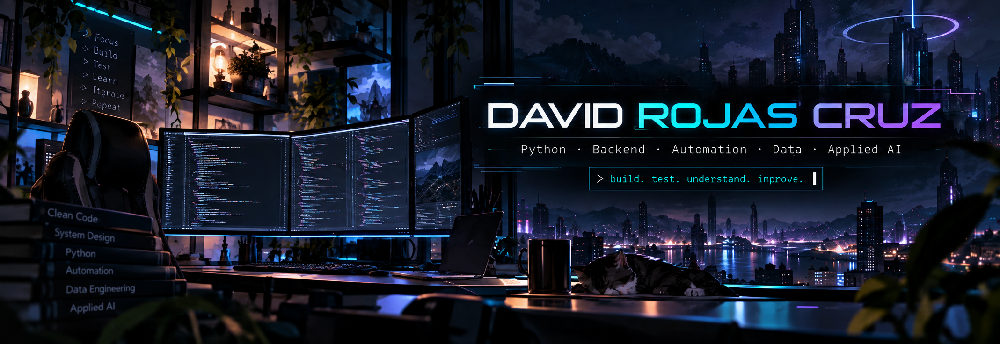
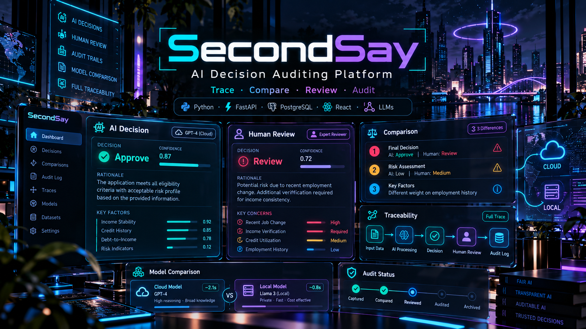
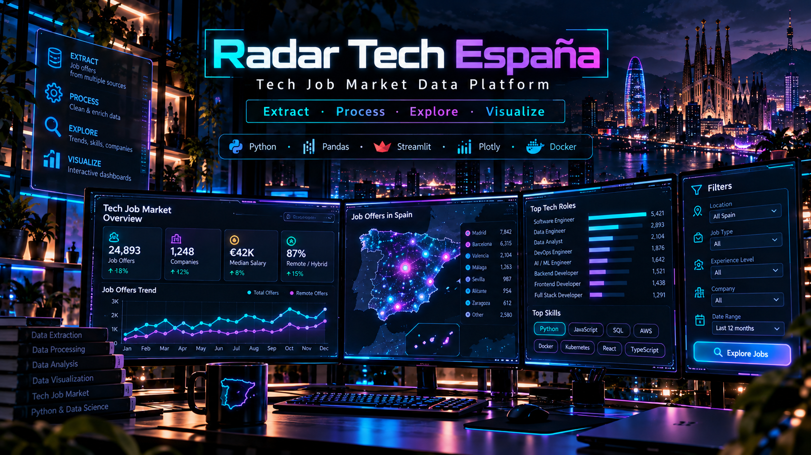
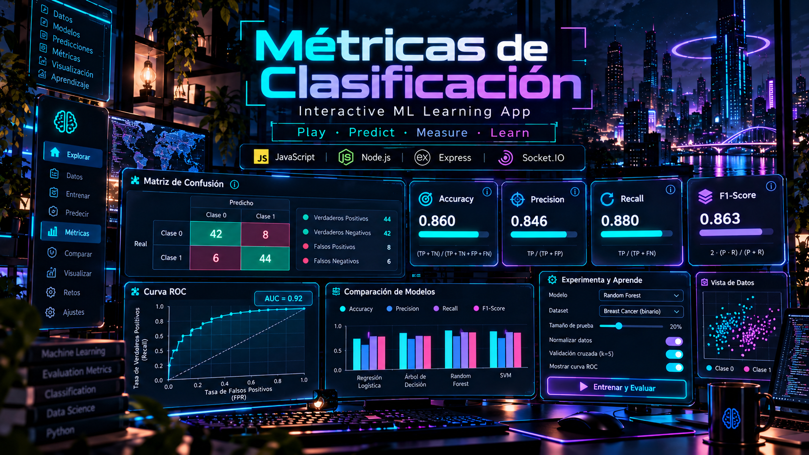
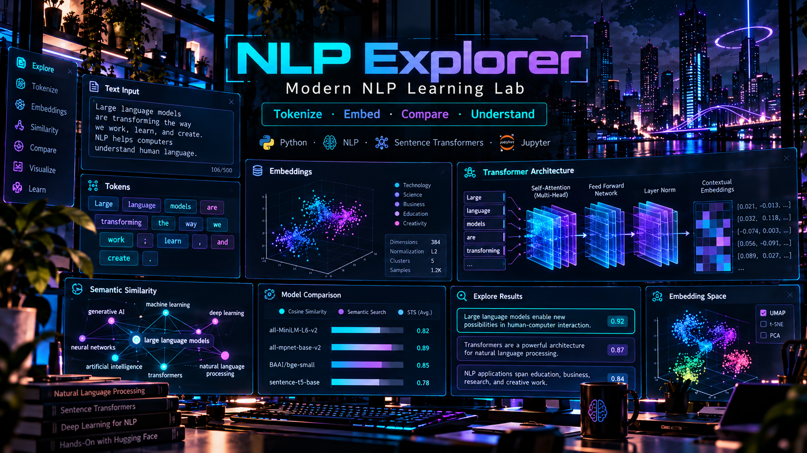

<p align="center">
  
</p>

<br>

```bash
$ whoami
David Rojas Cruz

$ current_focus
Software Development → Python → Backend → Automation → Data → Applied AI

$ location
Madrid, Spain
```

## // about_me

Vengo de entornos técnicos de **telecomunicaciones, testing y sistemas**, donde he trabajado con validación, análisis de incidencias, documentación técnica y resolución estructurada de problemas.

Ahora estoy orientando mi carrera hacia el **desarrollo de software**, construyendo proyectos donde puedo combinar código, datos, automatización e IA aplicada.

Me interesa especialmente entender cómo funcionan las cosas por dentro, convertir problemas concretos en herramientas y mejorar cada versión respecto a la anterior.

<br>

## // featured_builds

<table>
<tr>

<td width="50%" valign="top">

<a href="https://github.com/drojas-7u7/SecondSay">
  
</a>

<br><br>

Plataforma para auditar decisiones generadas por IA, compararlas con revisión humana y mantener trazabilidad sobre el proceso.

<br><br>

<a href="https://github.com/drojas-7u7/SecondSay"><strong>→ Repository</strong></a>

</td>

<td width="50%" valign="top">

<a href="https://github.com/drojas-7u7/radar-mercado-tech-espana">
  
</a>

<br><br>

Pipeline y dashboard interactivo para analizar ofertas tecnológicas y explorar distintos indicadores del mercado español.

<br><br>

<a href="https://github.com/drojas-7u7/radar-mercado-tech-espana"><strong>→ Repository</strong></a>
&nbsp;·&nbsp;
<a href="https://radar-mercado-tech-espana-t6vqbotubuzgoswrbxhlt9.streamlit.app/"><strong>Live demo ↗</strong></a>

</td>

</tr>

<tr>

<td width="50%" valign="top">

<a href="https://github.com/drojas-7u7/metricas-clasificacion">
  
</a>

<br><br>

Aplicación web multijugador para aprender Accuracy, Precision, Recall y F1-Score mediante una dinámica interactiva.

<br><br>

<a href="https://github.com/drojas-7u7/metricas-clasificacion"><strong>→ Repository</strong></a>
&nbsp;·&nbsp;
<a href="https://metricas-clasificacion.onrender.com/"><strong>Live demo ↗</strong></a>

</td>

<td width="50%" valign="top">

<a href="https://github.com/drojas-7u7/nlp-explorer">
  
</a>

<br><br>

Proyecto interactivo para explorar tokenización, embeddings semánticos y fundamentos de NLP moderno.

<br><br>

<a href="https://github.com/drojas-7u7/nlp-explorer"><strong>→ Repository</strong></a>
&nbsp;·&nbsp;
<a href="https://drojas-7u7.github.io/nlp-explorer/"><strong>Live demo ↗</strong></a>

</td>

</tr>
</table>

## // toolkit

<p align="center">
  
  
  
  
  
  
  
  
  
  
  
</p>

<p align="center">
  <sub>Herramientas y tecnologías con las que estoy trabajando en mis proyectos y formación actual.</sub>
</p>

<br>

## // current_arc

**Training**  
Desarrollo de Inteligencia Artificial · Somos F5 · 1250h

**Building with**  
`Python` · `SQL` · `Git/GitHub` · `Databases` · `Backend` · `Data` · `Applied AI`

**Next step**  
Junior Software Development · Python · Backend · Automation

## // connect

<p align="center">
  <a href="https://www.linkedin.com/in/david-rojas-cruz-27761b176">
    
  </a>
  &nbsp;
  <a href="https://github.com/drojas-7u7">
    
  </a>
</p>

<br>

<p align="center">
  <code>build → test → understand → improve → repeat</code>
</p>
